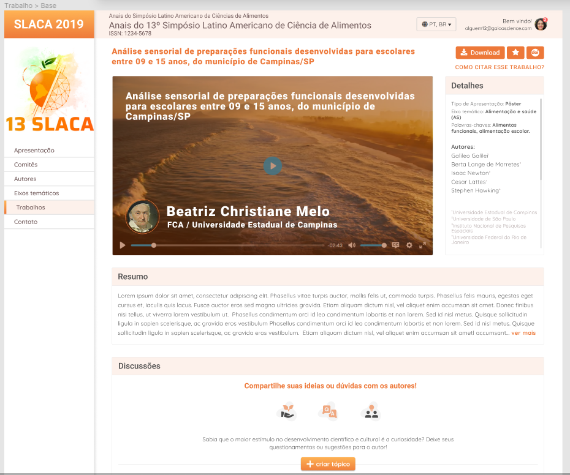

# ProjetoChuva

Processo seletivo para uma vaga de estágio, onde o objetivo era criar um website para uma convenção científica seguindo um layout disponibilizado no Figma.

O site está totalmente responsivo, 100% adaptado para acesso em dispositivos móveis (realizado com Media Querrys).

Minha primeira criação (e primeiro commit também) onde desenvolvi meus conhecimentos das tecnologias HTML, CSS (especificamente Flexbox) e JavaScript.

## Resultado

https://htmlpreview.github.io/?https://github.com/BrunoFernandesCruz/ProjetoChuva/blob/master/index.html

### Layout disponibilizado no Figma 

